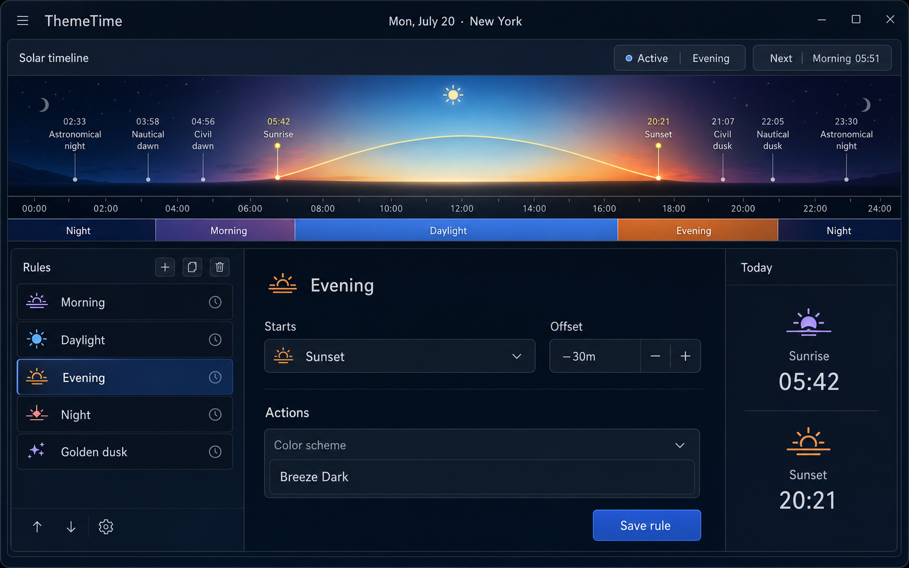
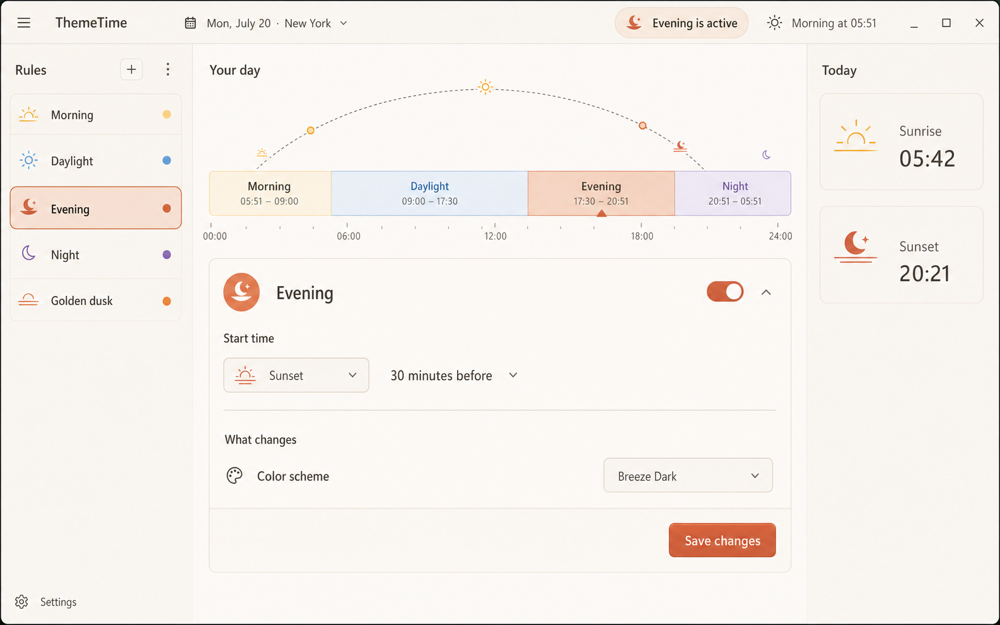
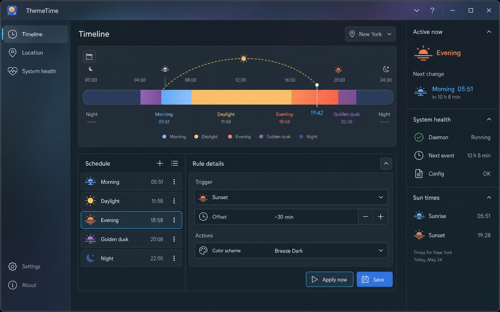

# ThemeTime UI directions

These mockups preserve ThemeTime's core workflow: understand the solar day, choose a rule, edit its trigger and actions, and confirm current/next state at a glance.

## 1. Solar Observatory

An atmospheric, product-defining dark theme. The solar timeline is the hero and gives ThemeTime an identity beyond a normal settings app.

- Best for: a memorable default theme
- Keep: scenic day ribbon, phase bands, compact three-column editor, clear active/next pills
- Watch: the scenic ribbon should be CSS/SVG rather than a raster backdrop, and must remain restrained at smaller window sizes
- Palette: `#071525`, `#12253A`, `#356FE5`, `#FF9B4A`, `#FFE07A`, `#C08CFF`

## 2. Sunlit Almanac

A warm editorial light theme that feels calm, legible, and unusually friendly for a desktop utility.

- Best for: a first-class light mode
- Keep: single editor card, plain-language labels, warm off-white canvas, visible phase duration ranges
- Watch: use enough border contrast for accessibility and reserve orange for selection/actions
- Palette: `#FBF8F2`, `#F2ECE3`, `#312D2A`, `#D85E36`, `#5D9FDC`, `#8760BD`

## 3. Aurora Glass

A KDE-native dark direction with efficient navigation, high information density, and restrained translucency.

- Best for: power users and strong Plasma integration
- Keep: section sidebar, integrated timeline, schedule/editor split, useful system-health inspector
- Watch: translucency should be optional and limited to chrome; content surfaces need reliable contrast
- Palette: `#101D29`, `#1C3041`, `#55BEEB`, `#FF8059`, `#F8C75C`, `#9E65BE`

## Recommended synthesis

Use Solar Observatory as the visual foundation, Aurora Glass for navigation and workspace density, and Sunlit Almanac as the light-theme counterpart. Specifically:

1. Make the 24-hour ribbon the signature component, with an SVG sun arc and CSS phase bands.
2. Use a compact rule list beside a single focused editor; avoid a wall of equally weighted controls.
3. Keep the right inspector contextual: current phase, next change, sunrise/sunset, daemon health.
4. Replace technical trigger language with human wording such as “30 minutes before sunset,” while preserving exact values in advanced controls.
5. Let the active phase tint only selection, the primary action, and timeline details—not every surface.

## Prompt set

All three were generated with the built-in image generation tool as high-fidelity `ui-mockup` concepts. Each prompt specified a full 16:10 KDE/Linux desktop window, the existing ThemeTime solar timeline/rule editor workflow, practical controls, accessible contrast, exact core labels, and no mobile layout, generic analytics dashboard, watermark, or decorative concept-art treatment. The concepts then varied the palette, surface treatment, density, and layout emphasis described above.
